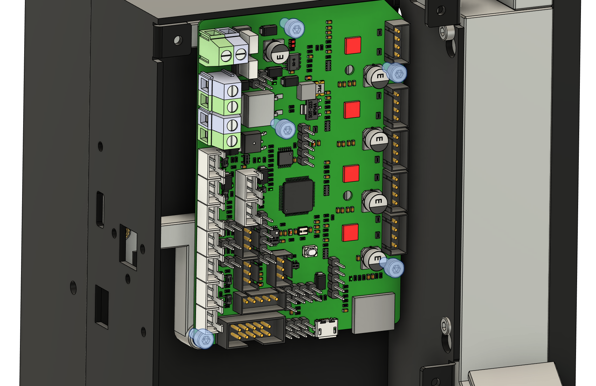

The Prusawire Electronics Tower is an alternative electronics mount
for the [Prusawire](https://www.printables.com/model/1363547-prusawire-2025b1-beta-1).

This mod is intended for users who converted a Prusa MK4S to a CORE One and have
the MK4 electronics box parts. It is only tested on the MK4 frame.

## Bill of Materials
Below is the bill of materials by part (in order by assembly) excluding wiring:
- `upper_frame_mount`
  - 1x M3x10 SHCS (DIN 912)
  - 1x M3x20 SHCS (DIN 912)
  - 2x M3x40 SHCS (DIN 912)
  - 1x M3x5x4 Threaded Insert (Voron spec)
- `door_puller_frame_mount`
  - 2x M3x10 SHCS (DIN 912)
  - 2x M3x5x4 Threaded Insert (Voron spec)
  - 4x M5 Hex Nut (DIN 934)
  - 1x Door Puller (See Prusawire sourcing guide)
- `door_puller_mount_cover`:
  - 4x M5x25 BHCS (ISO 7380)
  - 3x M3x10 SHCS (DIN 912)
  - 2x M3x5x4 Threaded Insert (Voron spec)
  - 1x M3 T-Nut for 3030 Extrusion
- `door_puller_idler_bracket`
  - (Same mounting as stock Prusawire; instructions not shown)
- `door_puller_anchor`
  - (Same mounting as stock Prusawire; instructions not shown)
- `door_puller_front_cover`
  - 1x M3x10 SHCS (DIN 912)
- `lower_electronics_raspberry_pi_base_wall`
  - **(There are 2 variants under the STLs)**
  - 4x M2.5x6 SHCS (DIN 912)
  - 6x M3x6 SHCS (DIN 912)
  - 1x M3x10 SHCS (DIN 912)
  - 10x M3x5x4 Threaded Insert (Voron spec)
  - 1x M3 T-Nut for 3030 Extrusion
  - 1x 24V to 5V Step-Down DC-DC Converter (See Prusawire sourcing guide)
  - 1x Raspberry Pi 3B+ or 4B+ (See Prusawire sourcing guide)
- [xBuddy Box](https://www.prusa3d.com/product/xbuddy-box/)
  - ([PrintedSolid](https://www.printedsolid.com/products/original-prusa-xbuddy-box))
- `xbuddy_electronics_holder_bottom_mount`
  - 4x M3x6 SHCS (DIN 912)
  - 2x M3x5x4 Threaded Insert (Voron spec)
- `lower_electronics_raspberry_pi_back_wall`
  - 2x M3x6 SHCS (DIN 912)
  - 2x M3x5x4 Threaded Insert (Voron spec)
- `wago_221-413_mount`
  - 2x M3x6 SHCS (DIN 912)
  - 4x WAGO 221-413 (See Prusawire sourcing guide)
- `btt_skr_electronics_mount`
  - 9x M3x6 SHCS (DIN 912)
  - 7x M3x5x4 Threaded Insert (Voron spec)
  - 1x BigTreeTech SKR Mini E3 v3.0 (See Prusawire sourcing guide)
- `ldo_nitehawk_usb_board_holder`
  - 4x M3x6 SHCS (DIN 912)
  - 2x M3x5x4 Threaded Insert (Voron spec)
- `heatbed_cable_holder`
  - 2x M3x6 SHCS (DIN 912)
- `electronics_box_top_cover_simple`
  - **(Do not print if using `electronics_top_cable_holder`)**
  - 2x M3x6 SHCS (DIN 912)
- `electronics_top_cable_holder`
  - **(Do not print if using `electronics_box_top_cover_simple`)**
  - 2x M3x6 SHCS (DIN 912)
  - 3x M3x5x4 Threaded Insert (Voron spec)
- `electronics_top_cable_cover_gridfinity`
  - **(Do not print if using `electronics_box_top_cover_simple`)**
  - 3x M3x8 SHCS (DIN 912)
  - 8x 6x2mm magnets
- [xBuddy Box Cover](https://www.prusa3d.com/product/xbuddy-box-cover-2/)
  - ([PrintedSolid](https://www.printedsolid.com/products/original-prusa-mk3-9-mk4-spare-parts?variant=40888363188309))
  - 4x M3x6 SHCS (DIN 912)
- `lower_electronics_main_cover`
  - 4x M3x6 SHCS (DIN 912)
  - 4x M3x5x4 Threaded Insert (Voron spec)
- `lower_electronics_bottom_cover`
  - 2x M3x6 SHCS (DIN 912)
- `lower_electronics_top_cover`
  - 2x M3x6 SHCS (DIN 912)

The following are also recommended but not required:
- 1x 3-port USB hub (2.0 is fine) + 1x right-angle USB port.
- 1x USB ribbon cable for the SKR Mini board (or cut the cover for the cable).

Most builds will most likely use the Electronics Top Cable Holder setup
due to the excess cable from the LDO Nitehawk. Electronics Box Top Cover
is a provided alternative if excess cable storage is not needed. **Excess
LDO Nitehawk cable will not fit in the electronics box**.

## Printing Notes
All `door_puller` files except `door_puller_front_cover` should be printed
with the same parameters as the rest of the printer parts. Otherwise, the
infill and perimeters can most likely be reduced for all other parts.

All parts should be printed without supports. Built-in supports
are provided on the following parts:
- Door Puller Front Cover
- Lower Electronics Raspberry Pi Base Wall

## Threaded Inserts
Below are the locations of all threaded inserts to install.

### `upper_frame_mount`

### `door_puller_frame_mount`

### `door_puller_mount_cover`

### `lower_electronics_raspberry_pi_base_wall`

### `xbuddy_electronics_holder_bottom_mount`

### `lower_electronics_raspberry_pi_back_wall`

### `btt_skr_electronics_mount`

### `ldo_nitehawk_usb_board_holder`

### `electronics_top_cable_holder`

### `lower_electronics_main_cover`

## Assembly
The order of assembly can matter since some parts will block the installation
of others. For example, the Lower Electronics Raspberry Pi Back Wall must be
after the xBuddy electronics box.

### `upper_frame_mount`
Mount the part with a **M3x20 SHCS** as shown. Additionally, insert
**2x M3x40 SHCS** and a **M3x10** as shown, but leave about 3mm or more
for the xBuddy box.

### `door_puller_frame_mount`
**Not pictured**:  Insert **4x M5 Hex Nuts** into the hexagon holes that
face the frame. These are intended to be tight. You may need to screw in
the hex nuts from the other side.

Mount the puller with **2x M3x10 SHCS** screws.

**Not pictured**: Place the **Door Puller** with the puller facing upwards
towards the bed.

### `door_puller_mount_cover`
Insert an **M3 T-Nut for 3030 Extrusion** where the xBuddy box would have
been mounted. Mount the cover with **2x M3x10 SHCS**, and then
**4x M5x25 BHCS** through the door puller and the hex nuts. Insert an
**M3x10 SHCS** through the bottom hole to the M3 T-Nut.

### `door_puller_front_cover`
Raise the gantry (if applicable) and mount the cover with a **M3x10 SHCS**
as shown. Only one screw is used to allow the cover to be removed and
service the X motor.

### `lower_electronics_raspberry_pi_base_wall`
Insert an **M3 T-Nut for 3030 Extrusion** where the xBuddy box would have
been mounted. Mount the wall to the T-nut using a **M3x10 SHCS** and secure
it to the puller cover with **2x M3x6 SHCS**.

Mount the **24V to 5V Step-Down DC-DC Converter** with **4x M3x6 SHCS**.
This will be located under the Raspberry Pi. The Raspberry Pi should be
installed later on once the WAGO mount is up and the step-down converter
is wired.

### xBuddy Box
Slide the xBuddy box over the 3 loose screws from before, and tighten
them down.

### `xbuddy_electronics_holder_bottom_mount`
Mount the holder with **4x M3x6 SHCS**, with 2 on the top of the Pi wall
and 2 at the bottom of the xBuddy box.

### `lower_electronics_raspberry_pi_back_wall`
Mount the back wall to the side wall with **2x M3x6 SHCS**.

### `wago_221-413_mount`
Mount the WAGO mount with **2x M3x6 SHCS**.

**Not pictured**: Clip in the WAGOs and wire them up to the power supply
and step-down converter. The WAGOs will require some force to press in
since they are snapped into place. Optionally, zipties the power cables
and motor X/Y/Z cables to the door puller cover.

Before mounting the pi:
- Prepare the wiring for the Raspberry Pi to the step-down converter.
- **Insert the storage is inserted since it will be annoying to insert
  after mounting.**

Mount the **Raspberry Pi** with **4x M2.5x6 SHCS** now that the step-down
converter is wired. These screws are self-tapping. Do not over-tighten.

### `btt_skr_electronics_mount`
Mount the board mount with **4x M3x6 SHCS** to the xBuddy box.

Wire the **BigTreeTech SKR Mini E3 v3.0** power before mounting, and then
mount it to the board mount with **5x M3x6 SHCS**. 3 mounting points aren't
used to reduce vibrations of the board from hitting the xBuddy box.

**Not pictured**: Optionally, connec thte X, Y, and Z motors. Prepare
the USB cable for the board.

### `ldo_nitehawk_usb_board_holder`
Mount the **LDO Nitehawk USB Board** to the USB adapter mount with
**2x M3x6 SHCS**. Prepare the USB cable for the USB adapter.

Connect the power for the toolhead board, and then mount the adapter
mount in the xBuddy box with **2x M3x6 SHCS**.

### `heatbed_cable_holder`
Route the heatbed cable assembly through the square hole originally used
on the MK4. While keeping the nylon filament in the guide on the inside
of the cable holder, mount the cable holder with **2x M3x6 SHCS**.

**Not pictured**: Optionally, connect the bed power and temperature sensor.

If there is not enough slack in the power cables, the LDO Nitehawk USB board
holder might have to be unmounted for this.

### `electronics_box_top_cover_simple`
**Not pictured**: Route the toolhead cables through the corner hole of
the excess cable box and xBuddy box.

Mount the top cover with **2x M3x6 SHCS**.

**If there is too much cable, use the top cable holder below.**

### `electronics_top_cable_holder`
**Not pictured**: Route the toolhead cables through the top center hole of
the xBuddy box.

Mount the top cable holder with **2x M3x6 SHCS**, and manage the cable in
the box.

### `electronics_top_cable_cover_gridfinity`
*(Only applicable when using Electronics Top Cable Holder)*

**Not pictured**: Optionally, press-fit in **8x 6x2mm magnets**. No
glue should be required.

Mount the top cable cover with **3x M3x8 SHCS**.

### xBuddy Box Cover
Mount the cover with **4x M3x6 SHCS**, like on the MK4.

### Lower Electronics Cover
**Not pictured**: Before covering the Pi, ensure the USB cables and display
connectors are routed.

This is made of 3 parts:
- Lower Electronics Main Cover
- Lower Electronics Bottom Cover
- Lower Electronics Top Cover

Combine the 3 using **4x M3x6 SHCS** and mount the cover with **4x M3x6 SHCS**.

